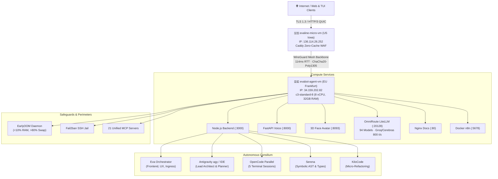

# EvaLine Network // Cluster Architecture, 94 LLMs & AI Consilium Dashboard

[](#)
[](#)
[](#)
[](#)
[](#)
[](#)
[](#)

Interactive dual-node cluster topology, real-time server resource telemetry (CPU, RAM, SWAP, NVMe, tmpfs), complete 94 LLMs roster (free quotas vs paid frontier pricing), financial accounting (CapEx & OpEx), and autonomous AI Consilium pipeline visualizer for **[evaline.network](https://evaline.network/)**.

---

## 🔤 Complete Roboto Superfamily & Typography
The site is built with the complete **Roboto superfamily** and all its typographic weights & styles:
- **`Roboto`**: Weights 100 (Thin), 300 (Light), 400 (Regular), 500 (Medium), 700 (Bold), 900 (Black); Normal & Italic.
- **`Roboto Mono`**: Weights 100 to 700; Normal & Italic.
- **`Roboto Condensed`**: Weights 100 to 900; Normal & Italic.
- **`Roboto Slab`**: Weights 100 to 900.
- **`Roboto Serif`**: Optical sizes 8..144, Weights 100 to 900; Normal & Italic.
- **`Roboto Flex`**: Variable font across all axes (`wght 100..1000`).

---

## 🌐 Trilingual Support (Instant Switching)
Zero-latency client-side language switching across three languages:
- 🇬🇧 **English (`EN`)**
- 🇺🇦 **Ukrainian (`UK`)**
- 🇷🇺 **Russian (`RU`)**

Supported via reactive `data-lang` attributes, URL query parameters (`?lang=en`, `?lang=uk`, `?lang=ru`), and `localStorage` state persistence.

---

## 🤖 94 Models Roster: Free Quotas vs Paid Pricing

The dashboard features a live line-by-line catalog of all **94 active models**:

### 1. Top Newest Paid Frontier Models (Pay-As-You-Go)
- **Claude 3.7 Sonnet (Vertex AI)**: In $3.00 / Out $15.00 per 1M tokens · 200k context · Hybrid reasoning.
- **DeepSeek R1 (Reasoning)**: In $0.55 / Out $2.19 per 1M tokens · 64k context · Chain-of-thought math & code.
- **Codestral 25.01 (Vertex AI)**: In $0.30 / Out $0.90 per 1M tokens · 256k context · Mistral AI code synthesis.
- **Meta Llama 3.3 (70B Instruct)**: In $0.70 / Out $0.90 per 1M tokens · 128k context.
- **Mistral Large 2 (Vertex AI)**: In $2.00 / Out $6.00 per 1M tokens · 128k context.

### 2. Top Free Tier Models ($0.00 OpEx)
- **Gemini 3.8 Flash (Next-Gen)**: 1,048,576 context · 15 RPM, 1M TPM, 1,500 RPD ($0.00 Free Quota).
- **Gemini 3.1 Pro (Frontier)**: 2,097,152 context · Deep Reasoning Studio free tier.
- **DeepSeek V3 (Community)**: 128k context · OpenRouter Free Tier ($0.00).
- **Qwen 2.5 Coder 32B**: 32k context · Dedicated Autonomous Coding free tier ($0.00).
- **Gemini 2.5 Flash**: 1,048,576 context · 15 RPM, 1M TPM, 1,500 RPD ($0.00 Free Quota).

---

## 💰 Financial Accounting: CapEx, OpEx & Tokenomics

### 1. Initial CapEx Investments ($1,500.00 USD)
- 📱 **Google Pixel 10 Pro XL** — **$1,000.00**: Hardware control panel, physical 2FA security key, and Google account registry terminal.
- 🖥️ **GCP Compute Core Plan (`evabot-agent-vm`)** — **$300.00**: Initial c3-standard-8 node reservation ($10/day from $500 tranche).
- 🔑 **Dev & Tool Subscriptions** — **$100.00**: Google AI Pro, Google Colab Pro, and developer tooling licenses.
- ⚡ **API Tokens Buffer Deposit** — **$100.00**: Initial reserve for OpenRouter, HuggingFace, Z.ai, Groq, Cerebras, Mistral, Cloudflare.

### 2. Monthly Infrastructure OpEx ($257.54 / mo · $0.3577 / hr)
- **Compute Core (`evabot-agent-vm`, 8 vCPU / 32 GB RAM)**: $178.40/mo
- **Edge Ingress (`evaline-micro-vm`, e2-micro)**: $7.14/mo
- **Persistent NVMe SSD (100 GB Root + Swap + Vector DB)**: $12.00/mo
- **WireGuard Tailscale Mesh Private Backbone**: $5.00/mo
- **Google AI Pro + Colab Pro Subscriptions**: $30.00/mo
- **OpenRouter Frontier Fallback Buffer**: $25.00/mo

### 3. Tokenomics & Enterprise Savings
- **Consilium Task Execution Cost**: **$0.0000** (100% Free Quota tier).
- **Savings per Agentic Run**: **$0.2250 – $0.3000 USD** compared to proprietary commercial APIs.
- **Monthly Enterprise Savings**: **$2,000 – $20,000 USD** (compressing routine API overhead by 85–99%).

---

## 🏗️ Physical Cluster Architecture



---

## ⚡ How the Consilium Works (4-Phase Pipeline)

1. **Phase 01: Ingestion & Intent Decomposition**
   - User query enters via Caddy HTTP/3 ingress on `evaline-micro-vm`.
   - Eva Orchestrator analyzes task scope, token allocation, and decomposes objectives into parallel sub-tasks.
2. **Phase 02: Parallel Specialist Deliberation**
   - Antigravity, OpenCode, Serena, and KiloCode work concurrently.
   - Agents query OmniRoute (94 models pool at up to 800 tokens/sec via Cerebras/Groq LPUs) and 21 MCP servers.
3. **Phase 03: Antagonistic Peer Review & Verification**
   - Candidate solutions are submitted to shared memory (`~/.mcp/sqlite.db`).
   - Serena checks AST invariants; OpenCode executes unit tests; EarlyOOM verifies RAM stability.
4. **Phase 04: Consensus Matrix & Atomic Synthesis**
   - Consensus scoring engine ranks proposals.
   - Atomic edits are applied to code, committed, and telemetry is logged to `/api/logs`.

---

## 📊 Live Resource Telemetry & Process Inspector
- **Memory Breakdown**: Physical RAM (used/total/pct) and SWAP telemetry (with idle `si/so = 0` status).
- **Process Inspector**: Live categorizer tracking 160+ system, agent, web, MCP, and LSP processes with instant search filtering.
- **Terminal View**: Full Cyber-TUI available at `/terminal` or via terminal curl:
  ```bash
  curl -s https://evaline.network
  ```

---

## 🚀 Deployment & Synchronization

```bash
# Push updates to GitHub
git add .
git commit -m "feat(network): full Roboto superfamily, 94 LLMs roster, & financial accounting"
git push origin main

# Sync to edge node
gcloud compute scp index.html evaline-micro-vm:/tmp/index.html --zone=us-central1-a
gcloud compute ssh evaline-micro-vm --zone=us-central1-a --command="sudo cp /tmp/index.html /var/www/evaline.network/index.html && sudo systemctl reload caddy"
```

---

## 📜 License
MIT License © 2026 EvaLine Network
