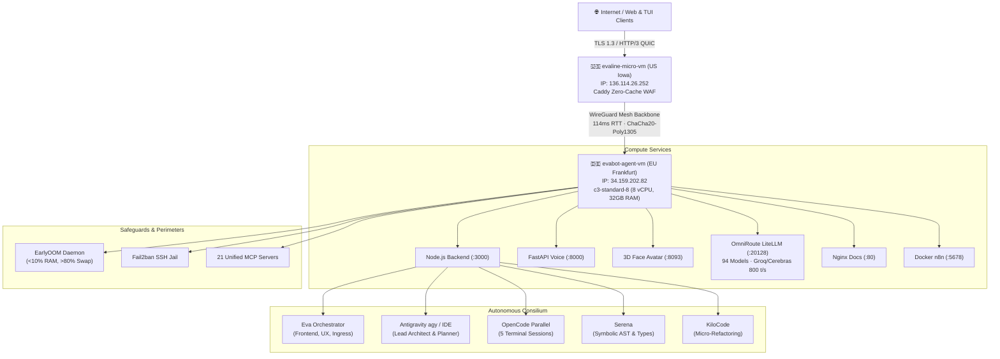

# EvaLine Network // Cluster Architecture & AI Consilium Dashboard

[](#)
[](#)
[](#)
[](#)
[](#)

Interactive dual-node cluster topology, real-time server resource telemetry (CPU, RAM, SWAP, NVMe, tmpfs), and autonomous AI Consilium pipeline visualizer for **[evaline.network](https://evaline.network/)**.

---

## 🌐 Trilingual Support (Instant Switching)
The dashboard features zero-latency client-side language switching without page reload across three languages:
- 🇬🇧 **English (`EN`)**
- 🇺🇦 **Ukrainian (`UK`)**
- 🇷🇺 **Russian (`RU`)**

Supported via reactive `data-lang` attributes, URL query parameters (`?lang=en`, `?lang=uk`, `?lang=ru`), and `localStorage` state persistence.

---

## 🏗️ Physical Cluster Architecture



### 1. Edge Ingress Node (`evaline-micro-vm`)
- **Location**: GCP `us-central1-a` (Council Bluffs, Iowa, USA)
- **Machine Type**: `e2-micro` (2 vCPU, 1 GB RAM, 2 GB SWAP)
- **Role**: Caddy reverse proxy, zero-cache policy, TLS 1.3 termination, HTTP/3 QUIC ingress.
- **Mesh Tunnel**: `100.125.200.49`

### 2. Compute Core & Matrix Node (`evabot-agent-vm`)
- **Location**: GCP `europe-west3-a` (Frankfurt, Germany)
- **Machine Type**: `c3-standard-8` (8 vCPU Intel Xeon Sapphire Rapids, 32 GB RAM, 8 GB SWAP, 50 GB NVMe)
- **Role**: Core application backend, multi-agent AI Consilium, model inference, and 21 MCP tools.
- **Mesh Tunnel**: `100.66.98.4`

---

## ⚡ How the Consilium Works (4-Phase Pipeline)

1. **Phase 01: Ingestion & Intent Decomposition**
   - User query enters via Caddy HTTP/3 ingress on `evaline-micro-vm`.
   - Eva Orchestrator analyzes task scope, token allocation, and decomposes objectives into parallel sub-tasks.
2. **Phase 02: Parallel Specialist Deliberation**
   - Antigravity, OpenCode, Serena, and KiloCode work concurrently.
   - Agents query OmniRoute (94 models pool at up to 800 tokens/sec via Cerebras/Groq LPUs) and 21 MCP servers.
3. **Phase 03: Antagonistic Peer Review & Verification**
   - Candidate solutions are submitted to shared memory (`~/.mcp/sqlite.db`).
   - Serena checks AST invariants; OpenCode executes unit tests; EarlyOOM verifies RAM stability.
4. **Phase 04: Consensus Matrix & Atomic Synthesis**
   - Consensus scoring engine ranks proposals.
   - Atomic edits are applied to code, committed, and telemetry is logged to `/api/logs`.

---

## 📊 Live Resource Telemetry & Process Inspector
- **Memory Breakdown**: Physical RAM (used/total/pct) and SWAP telemetry (with idle `si/so = 0` status).
- **Process Inspector**: Live categorizer tracking 160+ system, agent, web, MCP, and LSP processes with instant search filtering.
- **Terminal View**: Full Cyber-TUI available at `/terminal` or via terminal curl:
  ```bash
  curl -s https://evaline.network
  ```

---

## 📜 License
MIT License © 2026 EvaLine Network
